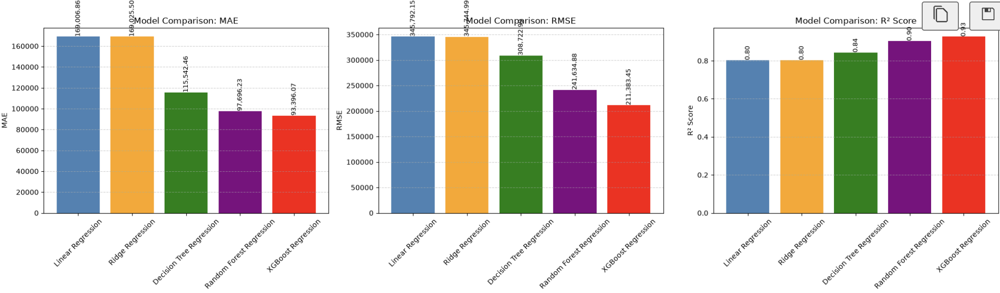

# WheelWorth

WheelWorth is an end-to-end machine learning web application that estimates the resale value of used cars from vehicle specifications such as brand, model, age, kilometres driven, fuel type, transmission, mileage, engine capacity, and power.

The project covers the complete ML workflow — from data cleaning and exploratory analysis to model comparison, cross-validation, hyperparameter tuning, pipeline creation, and deployment.

**Live App:** https://wheelworth-ai.streamlit.app/


---

## Overview

The goal of this project was to take the machine learning concepts I had learned and apply them to a complete real-world workflow rather than stopping at model training inside a notebook.

The dataset contains more than 15,000 used-car listings. I cleaned and explored the data, built a preprocessing workflow, trained five regression models, tuned the stronger models using cross-validation, and deployed the final XGBoost model through a Streamlit application.

The deployed application accepts vehicle details from the user and returns an estimated resale value in real time.

---

## Features

- Used-car resale value prediction
- Dynamic model selection based on the selected brand
- 11 vehicle features used for prediction
- Automated categorical and numerical preprocessing
- Multiple regression models compared
- Cross-validation and hyperparameter tuning
- Reusable Scikit-learn inference pipeline
- Responsive desktop and mobile interface
- Public deployment using Streamlit Community Cloud

---

## Machine Learning Workflow

```text
Raw Dataset
     ↓
Data Cleaning
     ↓
Exploratory Data Analysis
     ↓
Train / Test Split
     ↓
Feature Preprocessing
     ↓
Model Training
     ↓
5-Fold Cross-Validation
     ↓
Hyperparameter Tuning
     ↓
Model Comparison
     ↓
Final ML Pipeline
     ↓
Streamlit Application
     ↓
Deployment
```

---

## Dataset and Data Cleaning

The original dataset contained **15,411 used-car listings**.

The cleaning process included:

- Removing an unnecessary index column
- Checking for missing values
- Removing duplicate records
- Correcting invalid seat values
- Inspecting numerical distributions and potential outliers

After cleaning, the dataset contained **15,244 records**.

Exploratory analysis was then performed to study how factors such as vehicle age, kilometres driven, fuel type, transmission, engine size, power, brand, and model relate to selling price.

---

## Input Features

The final model uses the following 11 features:

| Feature | Description |
|---|---|
| Brand | Vehicle manufacturer |
| Model | Vehicle model |
| Vehicle Age | Age of the vehicle in years |
| Kilometres Driven | Total distance driven |
| Seller Type | Individual, dealer, etc. |
| Fuel Type | Petrol, Diesel, CNG, etc. |
| Transmission | Manual or Automatic |
| Mileage | Fuel efficiency in km/l |
| Engine | Engine displacement in cc |
| Power | Maximum power in bhp |
| Seats | Number of seats |

The target variable is **selling price**.

---

## Preprocessing

Categorical and numerical variables were processed separately using a Scikit-learn `ColumnTransformer`.

Categorical features were encoded using:

```python
OneHotEncoder(handle_unknown="ignore")
```

Numerical features were scaled using:

```python
StandardScaler()
```

The preprocessing steps were fitted only on training data.

During cross-validation, preprocessing was fitted again inside each training fold so that information from the validation fold did not leak into the model.

---

## Model Development and Tuning

Five regression models were compared during the project:

### Linear Regression

Linear Regression was used as the baseline model to establish an initial performance reference.

It achieved a test MAE of approximately **₹169K**.

### Ridge Regression

Ridge Regression was used to test whether L2 regularization could improve the linear model.

The regularization parameter `alpha` was tuned using cross-validation, with:

```python
alpha = 0.01
```

Its performance remained close to Linear Regression, suggesting that the main limitation was the linear nature of the model rather than excessive coefficient variance.

### Decision Tree

Decision Trees captured nonlinear relationships much better than the linear models.

Because unrestricted trees can easily overfit, I tuned:

```text
max_depth
min_samples_split
min_samples_leaf
```

The selected configuration was:

```python
max_depth = 12
min_samples_split = 2
min_samples_leaf = 1
```

Limiting tree complexity helped control overfitting while still allowing the model to capture nonlinear patterns.

### Random Forest

Random Forest further improved performance by averaging predictions from multiple trees.

The main parameters tuned were:

```text
n_estimators
max_depth
min_samples_split
min_samples_leaf
max_features
```

The selected configuration was:

```python
n_estimators = 100
max_depth = 20
min_samples_split = 3
min_samples_leaf = 1
max_features = 0.4
```

Bagging, feature sampling, and limits on tree complexity helped reduce the variance associated with a single Decision Tree.

### XGBoost

XGBoost produced the strongest overall performance.

The model was tuned using 5-fold cross-validation across parameters including:

```text
n_estimators
max_depth
learning_rate
subsample
colsample_bytree
```

The final configuration was:

```python
XGBRegressor(
    n_estimators=350,
    max_depth=10,
    learning_rate=0.03,
    subsample=0.7,
    colsample_bytree=0.8,
    random_state=42,
    n_jobs=-1,
    objective="reg:squarederror",
    eval_metric="mae"
)
```

The smaller learning rate allows the model to learn gradually, while row and feature subsampling introduce randomness that helps reduce overfitting.

Hyperparameter selection was based on cross-validation performance rather than simply choosing the configuration with the lowest training error.

---

## Model Performance

The models were evaluated using:

- **MAE — Mean Absolute Error**
- **RMSE — Root Mean Squared Error**
- **R² Score**

MAE was used as the primary model-selection metric because it directly represents the average prediction error in rupees.

| Model | Test MAE | Test RMSE | R² |
|---|---:|---:|---:|
| Linear Regression | ₹169,007 | ₹345,792 | 0.8033 |
| Ridge Regression | ₹169,026 | ₹345,745 | 0.8034 |
| Decision Tree | ₹115,542 | ₹308,723 | 0.8432 |
| Random Forest | ₹97,696 | ₹241,635 | 0.9040 |
| **Tuned XGBoost** | **₹93,396** | ₹211,383 | **0.9265** |



The final XGBoost model reduced MAE by approximately **44% compared with the Linear Regression baseline**.

Its mean 5-fold cross-validation MAE was approximately:

```text
₹94,591
```

and its test MAE was:

```text
₹93,396
```

The relatively similar validation and test errors provided additional confidence that the model was generalizing reasonably well.

---

## Why XGBoost Was Selected

The baseline XGBoost model produced slightly better RMSE and R², while the tuned version produced the lower MAE.

Since MAE was chosen as the primary evaluation metric for the project, the tuned model was selected for deployment.

This was also preferable to selecting a model purely based on its training performance, since the hyperparameters were evaluated using cross-validation.

---

## Final Pipeline

The preprocessing steps and trained XGBoost model were combined into a single Scikit-learn `Pipeline`.

```text
Raw Vehicle Details
        ↓
Categorical Encoding
        ↓
Numerical Scaling
        ↓
XGBoost Regressor
        ↓
Estimated Resale Value
```

This allows the deployed application to pass raw vehicle data directly to the model:

```python
prediction = final_pipeline.predict(input_data)
```

The pipeline handles preprocessing internally before generating the prediction.

The trained pipeline was saved using `joblib` and later loaded by the Streamlit application for inference.

---

## Web Application

The final model was integrated into a Streamlit application called **WheelWorth**.

Users can enter vehicle specifications and receive an estimated resale value instantly.


The application was also designed to work on mobile devices.

<p align="center">
  
</p>

**Try it here:**  
https://wheelworth-ai.streamlit.app/

---

## Tech Stack

### Machine Learning

- Python
- Pandas
- NumPy
- Scikit-learn
- XGBoost

### Data Analysis and Visualization

- Matplotlib
- Seaborn
- Jupyter Notebook

### Application

- Streamlit

### Development and Deployment

- VS Code
- Git
- GitHub
- Streamlit Community Cloud

---

## Project Structure

```text
wheelworth-used-car-price-prediction/
│
├── assets/
│   ├── asset1.png
│   ├── favicon-W-darkblue.ico
│   ├── wheelworth-desktop.png
│   ├── wheelworth-prediction.png
│   └── wheelworth-mobile.png
│
├── data/
│   ├── cardekho_dataset.csv
│   └── cleaned_cardekho_dataset.csv
│
├── Models/
│   └── final_pipeline.joblib
│
├── Notebooks/
│   ├── 01_data_exploration.ipynb
│   └── 02_model_training.ipynb
│
├── app.py
├── requirements.txt
├── .gitignore
└── README.md
```

---

## Run Locally

Clone the repository:

```bash
git clone https://github.com/Aaroh22/wheelworth-used-car-price-prediction.git
```

Move into the project directory:

```bash
cd wheelworth-used-car-price-prediction
```

Create a virtual environment:

```bash
python -m venv .venv
```

Activate it on macOS/Linux:

```bash
source .venv/bin/activate
```

On Windows:

```bash
.venv\Scripts\activate
```

Install the required packages:

```bash
pip install -r requirements.txt
```

Run the application:

```bash
streamlit run app.py
```

---

## Limitations

WheelWorth provides an estimated resale value based on patterns found in historical used-car listing data.

The model does not currently account for factors such as:

- Accident history
- Detailed vehicle condition
- Service history
- Repairs
- Local market demand
- Current market fluctuations
- Vehicle modifications or accessories

Predictions should therefore be treated as estimates rather than guaranteed selling prices.

---

## Future Improvements

Possible extensions to the project include:

- Training on a larger and more recent dataset
- Adding vehicle location as a feature
- Including service and accident history
- Adding model explainability using SHAP
- Experimenting with additional boosting models
- Monitoring model performance as new market data becomes available

---

## What I Learned

This project gave me practical experience with the complete machine learning lifecycle:

- Cleaning and exploring real-world tabular data
- Building preprocessing workflows
- Preventing data leakage during cross-validation
- Comparing linear and tree-based regression models
- Controlling overfitting through regularization and model complexity
- Hyperparameter tuning with 5-fold cross-validation
- Building reusable Scikit-learn pipelines
- Saving and loading trained models
- Connecting an ML model to a web application
- Deploying a machine learning application publicly

---

## Disclaimer

WheelWorth is an educational machine learning project. Predictions are generated from patterns learned from historical used-car listing data and should not be considered professional vehicle valuations.